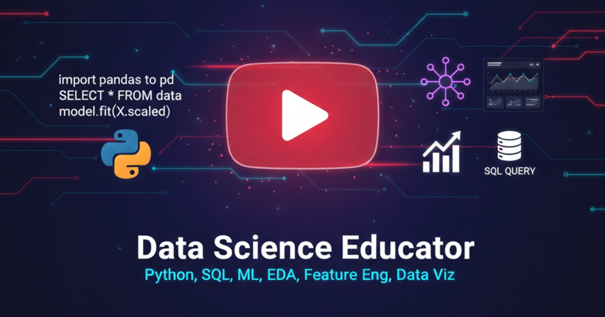

# Data Science Learning Path

A structured repository documenting my journey through Data Science — from Python fundamentals to Machine Learning. All materials are organized to support both my learning and anyone following a similar path.

  

---

## About This Repository

This repository serves as the working reference for my Data Science curriculum, currently being taught on my YouTube channel [Datascience ki Baatein](https://www.youtube.com/@datasciencekibaatein) — where I explain concepts in Hindi for absolute beginners.

Everything here is production-quality material, not throwaway notes. If you find a project, notebook, or explanation useful — take it, learn from it, build on it.

---

## Repository Structure

**`/python`** — Complete Python foundation series
Variables, data structures, control flow, functions, file handling, exception handling, modules & packages. Each topic includes a Jupyter notebook and video reference.

**`/projects`** — Portfolio-quality projects
End-to-end implementations covering multiple concepts. Currently includes the Student Marks Management System (Python capstone) with modular architecture.

**`/numpy-pandas`** *(coming soon)*
Data manipulation and analysis with NumPy and Pandas — the working toolkit of every Data Scientist.

**`/machine-learning`** *(coming soon)*
Supervised and unsupervised learning algorithms, with mathematical intuition and scikit-learn implementations.

**`/resources`** — Curated references
Cheat sheets, roadmaps, and reading lists I've personally found useful. Everything here is vetted, not scraped from Google.

---

## Learning Philosophy

I believe in three things when it comes to teaching Data Science:

**1. Foundation before frameworks.**
You cannot skip Python and jump to LangChain. The industry hires Data Scientists who understand systems — not people who prompt-engineer their way through problems.

**2. Language matters.**
Hindi-speaking learners deserve quality content in the language they think in. Translation isn't a "downgrade" — it's a bridge to underserved audiences.

**3. Depth over speed.**
A properly built 6-month curriculum beats a rushed 30-day bootcamp every time. Real skills compound.

---

## Tech Stack

Python | NumPy | Pandas | Matplotlib | Seaborn | Scikit-Learn | SQL | Statistics

---

## For Learners

If you're following along with the YouTube series, videos and notebooks are aligned. If you want to contribute — either through corrections, additional examples, or suggestions — open an issue or send a pull request.

If this repository saves you even a few hours of learning time, consider subscribing to the [YouTube channel](https://www.youtube.com/@datasciencekibaatein). That's the fuel that keeps this work going.

---

## Contact

For questions, collaborations, or corrections:
- **YouTube:** [Datascience ki Baatein](https://www.youtube.com/@datasciencekibaatein)
- **LinkedIn:** [Your LinkedIn URL]

---

*Currently teaching Python fundamentals. NumPy and Pandas begin next.*
